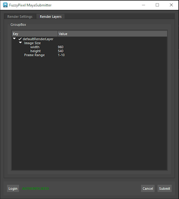

# tFuzzyPixel Maya Custom Submitter

FuzzyPixel is an AWS ‘customer zero’ team, working on real world productions to help design, prototype and test AWS services and features before they are released. This folder holds the bundles and scripts for the Maya custom submitter the FuzzyPixel team developed during our most recent production. The requirements for our custom submitter were:

1. **Update Project and Output Paths** : We have a Maya Launcher that dynamically determines the Project and Output Paths of scenes when they are opened. We wanted these fields to be automatically populated when the submitter is opened.
2. **Re-Organize GUI**: The Deadline Cloud Maya integrated submitter organizes GUI controls underneath four different tabs. Our team wanted to reorganize frequently used controls and place them underneath one major RenderSettings tab.
3. **Add Image Resolution** : Users on the team wanted to be able to control image resolution.
4. **Fleet Custom Attribute** : We wanted to allow users to choose whether their jobs would run on a spot or on demand instance.
5. **Render Layer Control** : Users wanted to be able to activate/deactivate render layers and control both image resolution and frame range for each render layer.

Requirements 1 and 3 can be achieved by creating a job bundle and then using deadline bundle gui-submit. Requirements 2, 4 and 5, are not easily achieved via bundle editing for the following reasons:

1. **Tab Reorganization**: Addition and removal of tabs from the Deadline Cloud Maya integrated submitter cannot be achieved via .yaml editing.
2. **QTree Widget**: We wanted to use a QTree Widget control to display layers, and this control is not available as a job template UI control.
3. **Surfacing Fleet Attributes** : In order to allow users to choose whether their jobs would run on a spot or on demand instance, we defined ‘spot’ and ‘onDemand’ fleet attributes in our farm and wanted to surface these attributes in our submitter.
4. **Custom Handlers**: The integrated submitter doesn't yet support updating template.yaml after clicking the submit button. Custom handlers are required for querying Maya, or modifying the custom submitter GUI, and then updating template.yaml *after* the user clicks the  'submit' button.

The FuzzyPixel custom submitter has two tabs, Render Setup and Render Layers as shown below.

We found that our goals of reorganizing the GUI, gaining access to the QTree widget and writing custom handlers for button clicks, were most easily achieved by writing a custom submitter from scratch. Our custom submitter leverages bundle data for job definition, and leans heavily on publicly available documentation for Qt controls. It's important to note that a custom Maya submitter can co-exist with the integrated Maya submitter, but custom submitters will not receive updates or patches released to the integrated submitter. Also, any updates to the AWS API and/or the Deadline API will need to be tested in the custom submitter prior to reliable use.

## Folder Contents

1. **fuzzypixelMayaRender:** This folder contains the initial job bundle used for the custom submitter. The submitter programmatically edits this based upon the current scene and GUI interaction prior to submission.
2. **image:** This folder contains images used for the README file. It is not part of the custom submitter.
3. **____init____.py:** Empty. Used for making the ../maya folder a python package.
4. **fp-deadlinecloud.bmp:** The button icon for the custom maya submitter. It gets installed on the AWS Deadline Maya shelf.
5. **maya_base_paths.py:** This class is used to specify custom paths used in maya_fp_deadline_render_pyqt_submitter.py, maya_launcher.py and maya_launch.py.
6. **maya_fp_deadline_render_pyqt_submitter.py:** This is the custom submitter application. The application uses separate classes for each GUI element, and one class for interacting with Deadline Cloud farms, queues and templates.
7. **maya_fp_maya_submission_status.ui:** A GUI for displaying submission status. This GUI is spawned by maya_fp_maya_submitter.ui.
8. **maya_fp_maya_submission_warning.ui:** This is a warning dialog spawned by maya_fp_maya_submission_status.ui in the case where a passable warning requiring user interaction occurs during submission.
9. **maya_fp_maya_submitter.ui:** This is the main submitter GUI. It has two tabs.
10. **maya_launch.py:** A simple python script that when run, launches maya with the custom submitter installed on the AWSDeadlineCloud shelf.
11. **maya_launcher.py:** A Maya launcher that facilitates setting up a shelf for the custom submitter.
12. **README.md:** The file you are currently reading.

## Prerequisites

Please fulfill the following pre-requisites before attempting to run the custom submitter. Note that this code sample runs only on Windows workstations.

1. A Windows workstation.
2. A farm, with a fleet and queue, plus the Deadline Cloud monitor and a profile created for your farm.
   1. [Deadline Cloud Documentation](https://docs.aws.amazon.com/deadline-cloud/latest/userguide/what-is-deadline-cloud.html)
3. Maya 2024 and the AWS Deadline Cloud Integrated Submitter.
   1. Visit the Autodesk Official site for Maya
   2. [Deadline Cloud Integrated Submitter Documentation](https://docs.aws.amazon.com/deadline-cloud/latest/userguide/submitter.html#submitter-installation)
4. An installation of Python-3.10.8  (For best results, use this specific version of python to match Maya 2024’s python version)
   1. [https://www.python.org/downloads/](https://www.python.org/downloads/)
   2. pip install deadline and gui dependencies into this version of python
      1. e.g. “C:\Program Files\Python-3.10.8\PCBuild\amd64\python.exe -m pip install deadline[gui]

## Setting Up the Custom Submitter

Be sure to fulfill all prerequisites above. Also, please note that this custom submitter is designed to work with a [Customer Managed Fleet](https://docs.aws.amazon.com/deadline-cloud/latest/userguide/manage-cmf.html) and [Storage Profiles](https://docs.aws.amazon.com/deadline-cloud/latest/developerguide/storage-profiles-and-path-mapping.html), i.e. the asset_references.yaml file wil always contain empty lists since a shared file system is assumed. You can easily update the script to write out found asset references.

1. Open maya_base_paths.py and update all of the paths and vars so that they reflect your host and farm setup.
2. Run the custom submitter by running the ***maya_launch.py*** file (**not to be confused** with maya_launcher.py)
   1. Example: C:\PathToPython-3.10.8/python.exe C:\PathToYourClone\deadline-cloud-samples\job_bundles\custom_submitter\maya\maya_launch.py

Maya will now launch and you'll see the FuzzyPixelDeadlineCloudSubmitter appear on the Deadline shelf. Be sure to wait until all of the modules have loaded before interacting wit the UI. Clicking around while modules are loading can sometimes cause Maya to crash.

---
